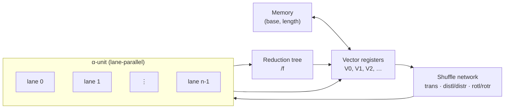
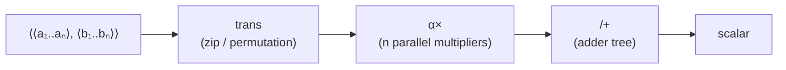

# Prompts to program ground up

The idea: make the prompt the primitive of the program.

Build a simple CPU and pair it with a simple language model — or the
simplest one we can find — and teach it to map prompts directly to programs
for that CPU. The intuition is that this is *easier* than what we are doing
now, not harder.

Mapping to RISC-V forces the model to learn things that have nothing to do
with "prompt → program": ELF section padding (long zero footers),
split-immediate value encoding across `lui` + `addi`, and the lack of a
binary terminator. Those are artifacts of targeting a real ISA and a real
container format. If we own the CPU, the instruction encoding, and the
binary format, none of them have to exist.

Caveat: simply trimming RISC-V down does not get us there. The pain comes
from the encoding and the wrapper, not the number of opcodes. To actually
escape the current failure modes, the ISA and the binary format have to be
co-designed with the model — small enough that the simplest viable LM can
plausibly learn the mapping end-to-end.

----

Might use DEC64 as the number format. One fixed-width decimal type, no
int/float split, and prompts like "0.1 + 0.2" behave the way the user
expects instead of giving the IEEE-754 surprise.

----

Backus actually builds the system in the paper (§11.2–11.3): primitives
like `trans`, `distl`, `+`, `×`, and functional forms like composition `∘`,
apply-to-all `α`, and insert/reduce `/`. He gives three worked programs —
factorial, inner product, matrix multiply. The cleanest one to translate
to hardware is inner product:

```
Def IP ≡ (/+) ∘ (α×) ∘ trans
```

Three stages, and each functional form *is* a piece of hardware: `trans`
is fixed wiring, `α×` is a lane-parallel ALU (SIMD), `/+` is an adder
tree. Scalars are just length-1 sequences, so there is no separate
scalar core. Memory is indexed by `(base, length)` rather than by word.

The rest of the combinators fill in the rest of the CPU: any `αf` is the
lane-parallel pattern, any `/f` is a reduction tree, the permutation
forms (`trans`, `distl`/`distr`, `rotl`/`rotr`) all live on one shuffle
network, and construction `[f₁,…,fₙ]` is broadcast plus parallel
evaluate. So the machine is just: vector registers, a lane-parallel
functional unit, a reduction tree, a shuffle network, and a
`(base, length)` memory.



Tracing `IP` through this machine: load both operands into vector
registers, route them through the shuffle network as `trans`, fan the
pairs across the lanes for `α×`, then collapse the lane outputs through
the reduction tree as `/+`.



The point: each FP combinator is a piece of hardware, and a program is
the graph wiring those pieces together. No PC, no temporaries, no ELF.

----

Backus's FP has descendants worth studying — FL (his own successor),
Bird–Meertens / Squiggol, APL/J/K, Joy/Factor, NESL/Futhark, Halide. For
this project two ideas are immediate wins.

**Blelloch's flattening transform (NESL).** The hardest thing about FP
on SIMD is nested `αα f` over ragged sequences — lanes don't naturally
handle vectors of varying length. Blelloch showed any nested data-parallel
program flattens mechanically into *segment descriptors* plus flat SIMD
ops. Add a *segmented scan* primitive (a length-aware reduction) and
nested `α` becomes free. This is the trick that let GPUs win.

**Bird–Meertens fold-as-one-primitive.** Do not bake `/+`, `/×`, `/min`
in as separate opcodes. There is one hardware op — a catamorphism —
parameterized by the combiner. ISA shrinks to a single `RED <op>`, which
is also easier for the LM to learn.

Watch-list, not now: **Halide's algorithm / schedule split**, where the
prompt names the algorithm and the schedule (lane width, tiling, fusion)
is picked separately. Would let us change hardware without retraining.

----

LM choice: GPT-2 small (~124M). Pretrained on WebText, which predates
the modern GitHub-flavored pretraining corpora, so it has minimal code
exposure but still knows English, basic conversation, and general world
knowledge — we can say "use the Pythagorean theorem" without first
explaining geometry. Can be tested immediately with the current dataset
and training pipeline — just swap the base model.

TinyStories-class models are cleaner (zero code)but cannot converse and
lack the math / CS vocabulary, so they are out for now. We might accumulate
a proper training dataset though, while working with the GPT-2 small sandbox.
